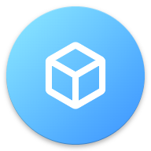

###  ‎

###  ‎

<p align="center">
  
</p>
<h1 align="center">StarryFiles</h1>
<h3 align="center">Just another file manager, simple yet powerful.</h3>‎‎

<p align="center">A clean, lightweight, and secure file manager, crafted with pure Material Design and modern Linux-native engineering.</p>
<p align="center">Made with ❤️ by <a href="https://github.com/lingyicute">lingyicute</a>.</p>

###  ‎

<p align="center">
  [🇺🇸 English] • <a href="README_zh-CN.md">🇨🇳 中文</a> •
  <a href="https://sf.92li.uk/">🌐 Official Website</a> •
  <a href="https://github.com/lingyicute/StarryFiles/releases">📦 Download APK</a> •
  <a href="https://github.com/lingyicute/StarryFiles/issues">🐛 Report Bug</a>
</p>

<p align="center">
  <a href="https://github.com/lingyicute/StarryFiles/releases"></a>
  <a href="https://developer.android.com/about/versions/lollipop"></a>
  <a href="LICENSE"></a>
  <a href="https://sf.92li.uk/"></a>
  <a href="https://github.com/lingyicute/StarryFiles"></a>
</p>

---

## 📖 Overview

Most modern Android file managers fall into one of two extremes: closed-source tools loaded with advertisements and analytics, or clunky utilities plagued by inconsistent UI details and fragile `ls` command parsing.

**StarryFiles** is engineered to bridge this gap. By decoupling the file system layer using **Java NIO.2 File APIs** and leveraging direct **Linux libc syscalls via JNI**, StarryFiles provides desktop-grade file management capabilities (symbolic links, Linux file permissions, SELinux contexts, and remote protocol support) wrapped in a fluid, polished Material You interface.

---

## ✨ Features

- **🎨 Pure & Clean Material Design**
  - Crafted with strict adherence to Material guidelines: meticulous layout, alignment, paddings, icons, and typography.
  - **Material You Dynamic Theming**: Generates harmonious palette schemes from wallpaper seed colors.
  - Day / Night mode with optional **AMOLED True Black** theme.

- **🔒 100% Open Source & Privacy-First**
  - Licensed under **GPL-3.0**.
  - **No advertisements, no tracking, no analytics, no unnecessary background services.**
  - Safe and transparent Root privilege execution—audit every action yourself.

- **🧭 Breadcrumb Navigation**
  - Interactive breadcrumb bar displays full directory hierarchy, enabling swift one-tap hopping and back-tracing.

- **📦 Rich Archive Support**
  - Directly browse, extract, and create common archive formats (ZIP, TAR, GZ, 7z, and more) without third-party tools.

- **🌐 Network Storage (NAS & Cloud)**
  - Seamlessly browse remote network shares as if they were local folders:
    - **SMB** (Windows Share / Samba)
    - **SFTP** (SSH File Transfer Protocol)
    - **FTP / FTPS**
    - **WebDAV**

- **⚡ Linux-Aware & Root Management**
  - Full root explorer support for system partition administration.
  - Desktop-grade file handling (like Nautilus): supports **symbolic links**, **POSIX permissions (chmod/chown)**, and **SELinux context**.
  - Properly handles non-standard and invalid UTF-8 filename encodings.

- **🚀 Robust & High-Performance Architecture**
  - Powered by **JNI bindings directly to libc syscalls** rather than fragile `ls` stdout parsing or outdated `java.io.File` APIs.
  - Clean MVVM architecture built upon Android Jetpack **ViewModel** and **LiveData**.

---

## 📱 Screenshots

<p align="center">
  
  
  
</p>

<p align="center">
  
  
  
</p>

---

## 🛠️ Why StarryFiles? (Under the Hood)

### 1. Decoupled Java NIO.2 Backend
Instead of relying on monolithic models where UI logic and file operations are tightly coupled, StarryFiles implements the standard **Java NIO.2 File API** structure as its foundation. This modular architecture minimizes bugs and allows seamless integration of new virtual/remote file systems.

### 2. Direct Linux System Calls (No `ls` Parsing)
`java.io.File` is a legacy Java 1.0 API lacking support for symbolic links, permissions, and atomic operations. Many file managers attempt to bypass this by parsing shell `ls` command outputs—an approach that is slow, error-prone, and frequently broken across Android updates. StarryFiles binds directly to native Linux syscalls via C/C++ JNI, ensuring speed, stability, and full POSIX compliance.

### 3. Modern Reactive Frontend
Built with **Android Architecture Components (ViewModel, LiveData)**, StarryFiles handles configuration changes (such as screen rotation) smoothly, guarantees robust background task management, and handles file conflict resolutions gracefully.

---

## 📥 Download & Installation

- **[GitHub Releases](https://github.com/lingyicute/StarryFiles/releases)**

### System Requirements
- **Android Version**: Android 5.0 (Lollipop, API Level 21) or above.
- **Root Permission**: Optional (only required for `/system`, `/data`, and restricted partition modifications).

---

## 🔨 Building from Source

### Prerequisites
- **JDK 17** or newer
- **Android SDK** (API Level 34+ recommended)
- **Android NDK** & **CMake** (configured via SDK Manager for JNI compilation)

### Build Commands

1. **Clone the repository**:
   ```bash
   git clone https://github.com/lingyicute/StarryFiles.git
   cd StarryFiles
   ```

2. **Build Debug APK**:
   ```bash
   ./gradlew assembleDebug
   ```

3. **Build Release APK**:
   ```bash
   ./gradlew assembleRelease
   ```

The compiled APKs will be located under `app/build/outputs/apk/`.

---

## 💡 Notes for Custom ROM Maintainers

Thank you for choosing to bundle StarryFiles in your custom ROM distribution! To ensure optimal end-user experience:

1. **Do not replace AOSP `DocumentsUI`**: StarryFiles is not designed to replace Android's framework storage picker and relies on `DocumentsUI` for Storage Access Framework (SAF) permissions (such as external SD card write access).
2. **Allow uninstallation / disabling**: Please ensure users can uninstall or disable the app if they prefer another file manager.
3. **Signature integrity**: If you sign system apps with custom release keys, please rename the application package ID to avoid update signature mismatches with GitHub release packages.

---

## 🤗 Contributing

Contributions are always welcome!
- **Bug Reports & Feature Requests**: Submit an issue on the [GitHub Issue Tracker](https://github.com/lingyicute/StarryFiles/issues).
- **Pull Requests**: Ensure code adheres to existing formatting guidelines and passes CI tests before submitting.
- **Translations**: Help localize StarryFiles into more languages.

---

## 📄 License

```text
Copyright (C) 2025-2026 lingyicute <li@92li.uk>

This program is free software: you can redistribute it and/or modify
it under the terms of the GNU General Public License as published by
the Free Software Foundation, either version 3 of the License, or
(at your option) any later version.

This program is distributed in the hope that it will be useful,
but WITHOUT ANY WARRANTY; without even the implied warranty of
MERCHANTABILITY or FITNESS FOR A PARTICULAR PURPOSE. See the
GNU General Public License for more details.

You should have received a copy of the GNU General Public License
along with this program. If not, see <https://www.gnu.org/licenses/>.
```
